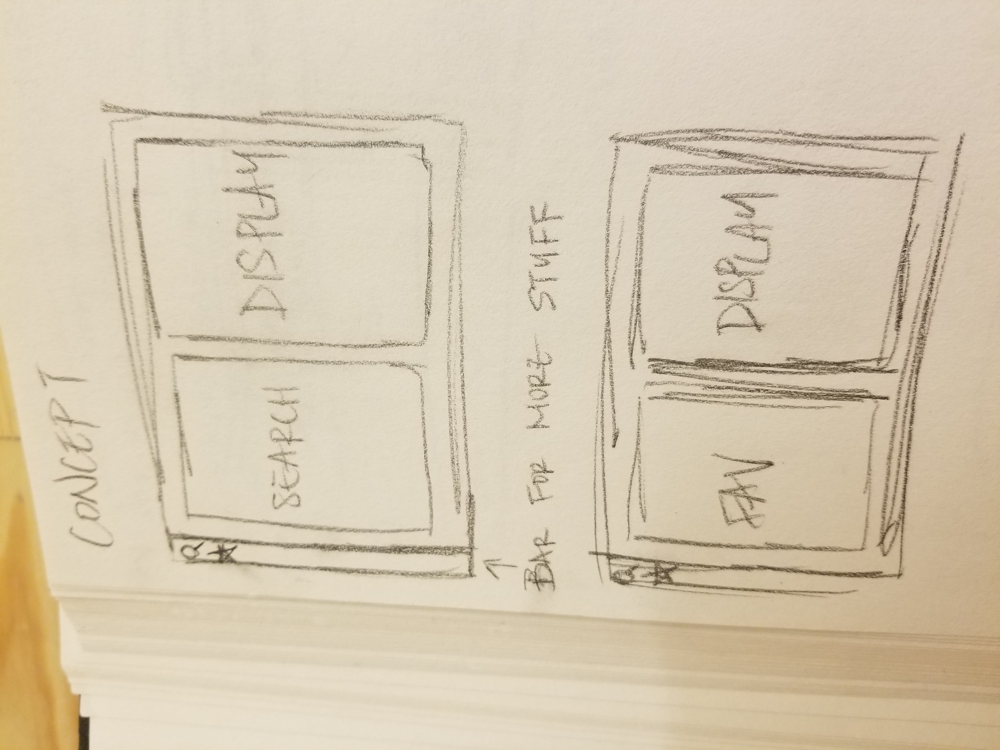
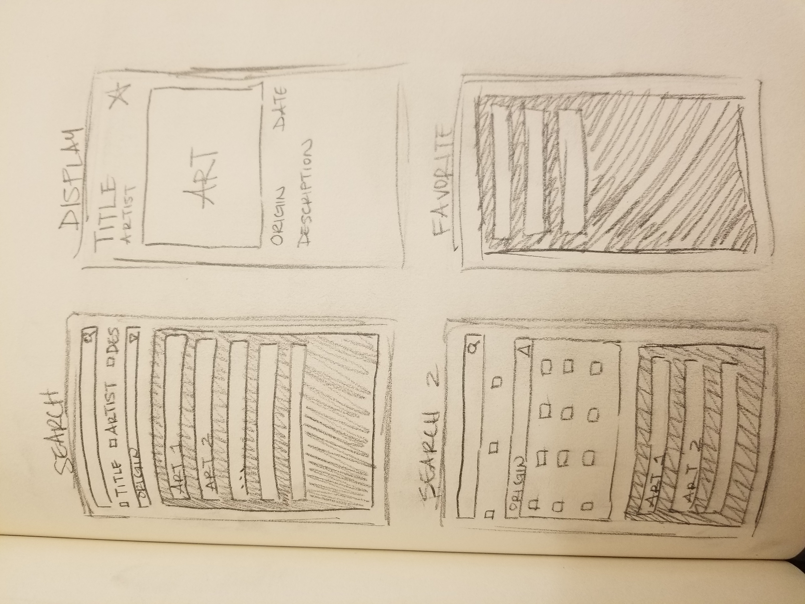
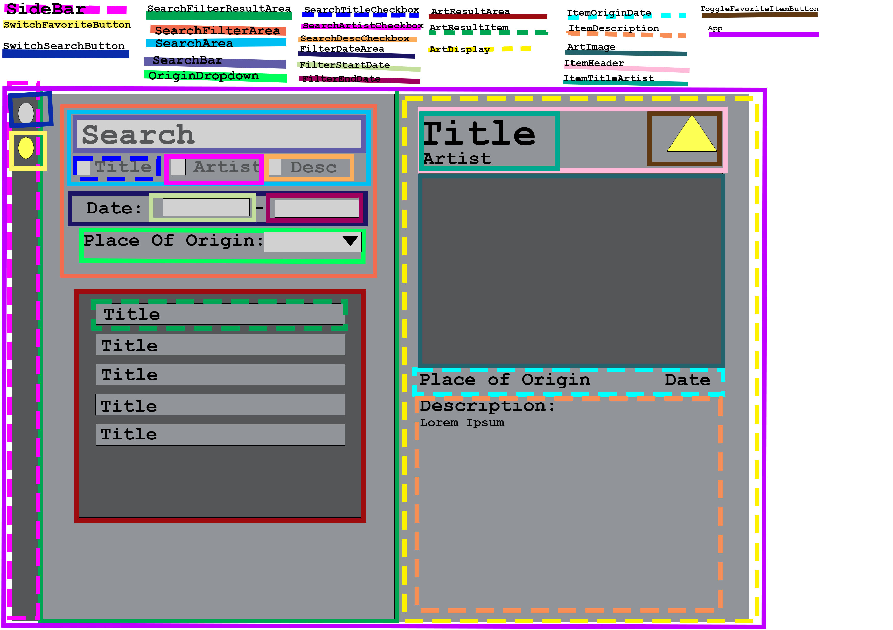

# ATLS-4630---Project-2-React

Deployment: https://atls-4630-project-2-react.vercel.app/ 

# Milestone 1: Project Proposal
    Team Members: Tessa Hammond, Annie Cai

## Description: 
The purpose of this single page application is to allow users to filter and search for artworks. Our inspiration were the in class examples and our access to a database of artworks. The application is intended for people who are interested in finding artworks and/or searching for an artwork.

## Wireframe: 

## Content/Information Sources: 
Art Institute of Chicago API & Database: https://api.artic.edu/docs/#data-dumps 

## Goals: 
We plan on creating a small database by picking and choosing information from the original database. We plan on implementing ways of searching through and filtering the information (such as searching for words, by dates, or by place of origin).

### PROTOTYPING/PROOF OF CONCEPT:
    - search thing ready → all the search things
    - display
    - 6 artworks in our database
### MINIMUM VIABLE PRODUCT:
    - have favorites page complete & favoriting working
    - 15 artworks in our database
### STRETCH GOALS:
    - responsive design
    - add stuff to sidebar
        - note taking
    - add more artworks into our database

## Contributions:
Find on our seperate progress blogs

# Milestone 2: WIP Check-in

## Thinking In React:

### STEPS 3 & 4:
    - States in the SearchFilterResultArea
        - searchText: will work like searchText in class examples. 
        user types into search bar and information is used to filter
        - searchTitle: checkbox to decide if we will search the title
        if true, we will check for the searchText in the title of the artwork.
        - searchAuthor: checkbox to decide if we will search the author
        if true, we will check for the searchText in the author of the artwork.
        - searchDesc: checkbox to decide if we will search in the description
        if true, we will check for the searchText in the description.
        - filterStartDate: input for the minimum start date
        will filter out any artworks that start before inputted date
        - filterEndDate: input for the maximum end date
        will filter out any artworks that end after inputted date
        - filterOrigin: input for place of origin
        will filter out any artworks that are not of the same place of origin
    - States in App
        - showFavorites:
        will filter the results to only show favorites
        - artDisplayIndex: 
        passes the id of the display art from the art result item to the App and to the ArtDisplay
        - favorites: a mutable array to track the user’s favorites

## General Progress Update:
    - Completed Thinking in React Steps 1, 3, 4
        - changed place of origin checkboxes to a dropdown
        - talked about the potential states and how they would theoretically work
    - Created the basic template for the components

## Progress & Personal Contribution:
Find on our seperate progress blogs